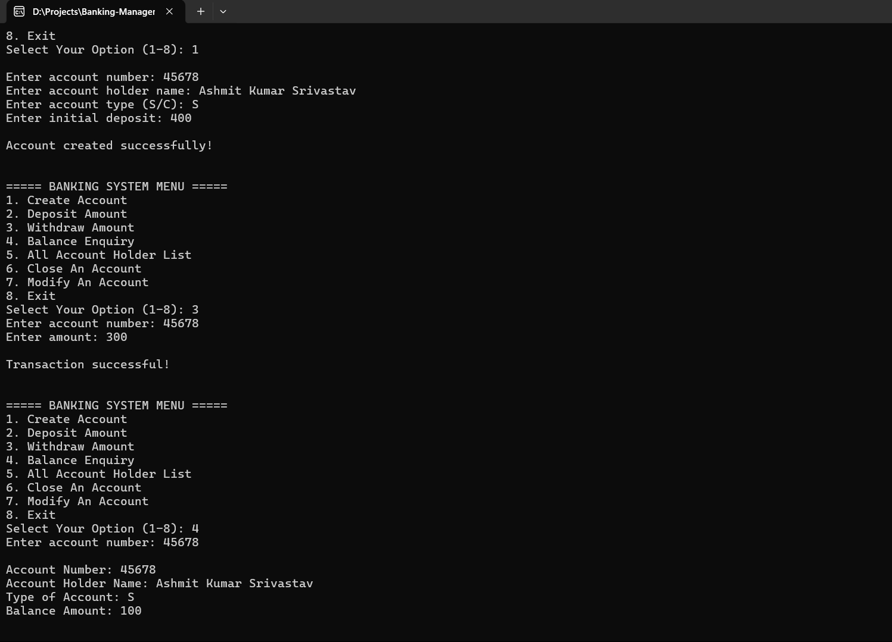

# 🏦 Banking Management System

A modern, menu-driven **C++ console application** that simulates basic banking operations like account creation, deposits, withdrawals, and balance inquiries.  
This project demonstrates strong **Object-Oriented Programming (OOP)** concepts, file handling, and structured code design in C++.

---

## 📖 Table of Contents
- [About](#-about)
- [Features](#-features)
- [Tech Stack](#-tech-stack)
- [Setup Instructions](#-setup-instructions)
- [Usage](#-usage)
- [Demo](#-demo)
- [Future Enhancements](#-future-enhancements)
- [Author](#-author)

---

## 💡 About
The **Banking Management System** is a simple C++ project that allows users to:
- Create and manage multiple bank accounts
- Deposit or withdraw funds
- View account details
- Delete or modify existing accounts  

This project is perfect for beginners learning **C++ classes, structures, vectors, and data storage**.

---

## ✨ Features
✅ Create a new bank account  
✅ Deposit and withdraw money  
✅ View account balance and details  
✅ Modify or delete existing accounts  
✅ Display all account holders  
✅ User-friendly console interface  
✅ Built with clean OOP principles  

---

## 🧠 Tech Stack
| Tool | Purpose |
|------|----------|
| 🖥️ **C++ (C++17)** | Core language |
| ⚙️ **OOP Concepts** | Classes, encapsulation, data abstraction |
| 📄 **File Handling** | For data storage (optional enhancement) |
| 💻 **VS Code / MinGW** | Development environment |

---

## ⚙️ Setup Instructions

### 1️⃣ Clone the Repository
```bash
git clone https://github.com/Ashmit76311/Banking-Management-System.git
cd Banking-Management-System
2️⃣ Compile the Program
bash
Copy code
g++ -std=c++17 bank_system.cpp -o bank_system
3️⃣ Run the Executable
bash
Copy code
./bank_system
or on Windows PowerShell:

bash
Copy code
.\bank_system.exe
🏃 Usage
When you run the program, you’ll see a simple text-based menu:

markdown
Copy code
===== BANKING SYSTEM MENU =====
1. Create Account
2. Deposit Amount
3. Withdraw Amount
4. Balance Enquiry
5. All Account Holder List
6. Close An Account
7. Modify An Account
8. Exit
Enter the number corresponding to the desired action, and follow the prompts.

## 🪐 Demo Preview 


🚀 Future Enhancements
🔹 Add login authentication for security
🔹 Implement transaction history
🔹 Add interest calculations and reports
🔹 Save data permanently using file storage or JSON
🔹 Develop GUI version using Qt or web interface

👨‍💻 Author
Ashmit76311
📫 GitHub Profile
